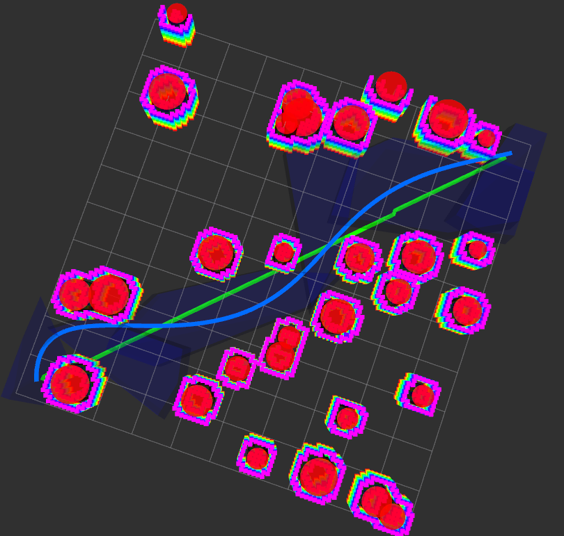

# Trajectory-Homework-for-ZJU-Intelligent-Mobile-Robot-Course
The A * algorithm used in the front-end (The front-end has optimized the A * algorithm with shortcut through visibility) and the Minco algorithm used in the back-end

# 项目成绩 🎉
<p style="color: green; font-size: 24px;"><strong>成绩：98 分</strong> 🌟</p>

## 安装方式

clone本仓库代码到ros工作空间夹的src文件夹下

### 注意事项

由于我们后端使用的是MINCO轨迹类，所以请先配置好gcopter的环境
可见（https://github.com/ZJU-FAST-Lab/GCOPTER）
或者直接在命令行输入以下内容:

```bash
sudo apt update
sudo apt install libspdlog-dev
sudo apt install cpufrequtils
sudo apt install libompl-dev
sudo cpufreq-set -g performance
```

编译

```bash
cd ..
catkin_make
source devel/setup.sh
```

运行

```bash
roslaunch astar_path_planner astar_planner.launch
roslaunch gcopter global_planning.launch 
```

## 结果展示



